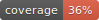

## **IPOLITIC/NAWP** 

To install the project, simply run `composer install` for installing server PHP deps. Then run `npm install` or `yarn` in your terminal for installing javascript deps.

Now you have to create a `configs/.env` file using the `configs/.env.dist` one as sample so that the software is able to use your settings.

Demo project database file is available as `config/nawpcore-****-database.sql`. Currently available in both MYSQL and MSSQL formats.
As the database is abstracted using Atlas (PHP LIB) if you want an other database engine, your only have to translate the database creation script.

## Minimum requirements 
- PHP >= 7.2.0 
- NodeJS  >= 10.0.0 
- Supported os : Windows || MacOS || Linux 

## Project commands 

All commands built as `npm` scripts.  
Use `yarn` or `npm run` to run one of the following commands :

- `start-win` : Will start all the server workers (windows mode).
- `start-unix` : Will start all the server workers (unix mode).
- `test` : Will run tests.
- `cs-fix` : Will fix coding style of all php source files.
- `generate-models` : Will read your database (using .env data and atlas) to generate all your models 
- `build-dev`: Will build the client side typescript app in the public/ folder.
- `build-prod` : Will build the client side typescript app in production mode.
- `watch-client`: Will watch for changes in client-side files and rebuild needed app parts when needed.
- `watch-server` : Will watch for changes in php files and restart the server when needed.
- `watch `: Will watch for both client and server changes, and will asynchronously rebuild the needed app parts or restart the server.
- `lint` : Will analyse your client source code using tslint.

## Framework features

 - **Server-side rendering** :  _using only modern PHP 7 CLI with new exception catches management, workman and twig._ 
 
 - **Client-side rendering** :  _using twig.js and morphdom DOM diffing lib for smooth updates_ 
 
 - **Modern SASS & Typescript transpiling, modern app** :  _using webpack, and modern libs like sass, typescript ... For a pleasant source code. 
 We also use developer-friendly libs such as jquery but with our own `states` system for once again, performance gains for both visitor CPU and your productivity_ 
 
 - **Support private browsers and legacy browsers** : _When javascript _is disable_, visitor can still switch pages, perform forms and href using the legacy web features. 
   We are also using bootstrap 3 with retro-compatible css and javascript thanks to webpack._
 
 - **High speed even under 2G or any poor connexion** : _When javascript _is enable_, all form and href tags add redirected to the same url and so controllers but using this time the `SOCKET` request type. This call is performed by socket.io client and so support legacy browsers, and provide nice speed.
 The data provided by the php server is then very small as only data of a component will be given in order to re render twig.js components._ 
 
 - **User and admin friendly ORM db models** : _using Atlas_
 
 - **Developer friendly controllers** :  _using our own **POLITIC/SOLEX**_ router
 
 - **Admin friendly configuration** :  _using a 10 line .env file ( **SYMFONTY/DOTENV** component ) and 2 webpack files_
 
 - **Base skeleton** : _Enjoy a fully working CMS with all the basics features that you would expect from it._
 
 - **Extendable architecture** : _Use bundles to share controllers and assets between your projects_

## We are using the best packages out there
- `twig`..................._For server-side rendering_
- `twig.js`................_For client-side rendering_
- `jquery`................._For dom manipulation but with our own javascript states system for perfs. gains._
- `webpack`................_Fast modules and source code web packing_
- `typescript`............._Enjoy the best of the javascript powers_
- `atlas`.................._Models, Models generation and nothing else_
- `node-sass`.............._.scss files are supported ;)_
- `socket.io-client`......._socektio client implementation._
- `nodemon`................_Enjoy server refresh on sourcecode changes !_
- `iPolitic/Workerman`....._Our own fork of workerman (php async engine)_
- `iPolitic/phpsocket.io`.._Our own fork of phpsocketio (php socket.io server)_
- `iPolitic/Bike`......... _Our own fork of Bike (php router)_
